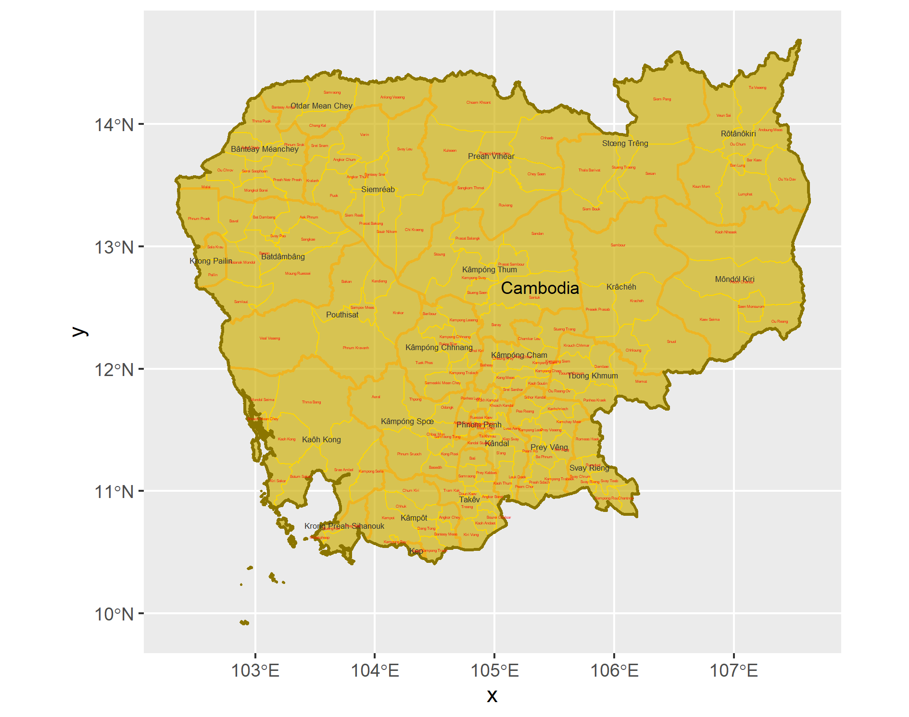
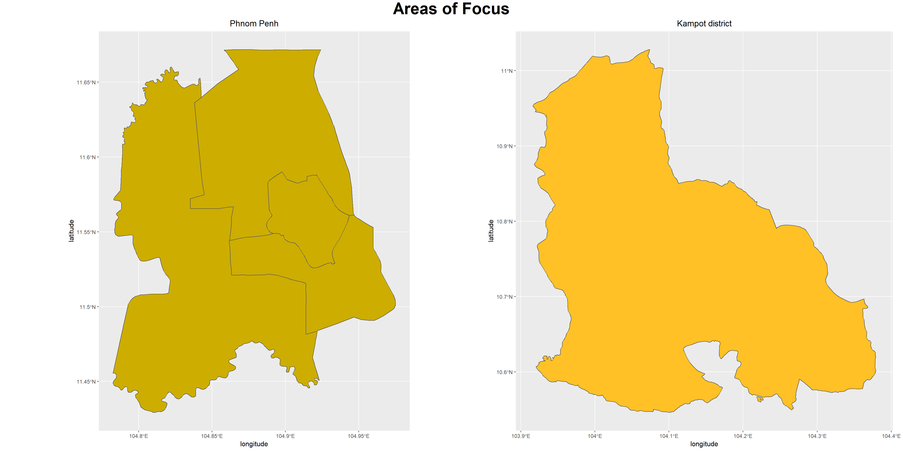
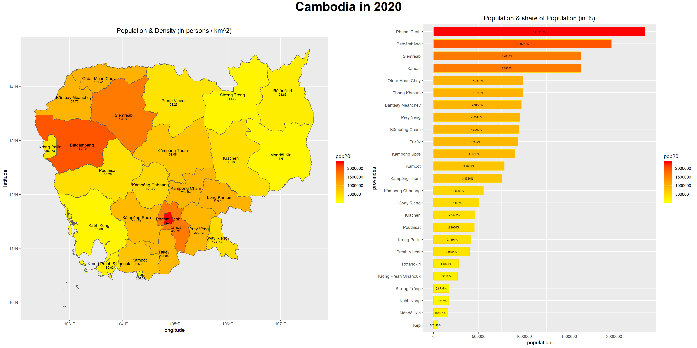
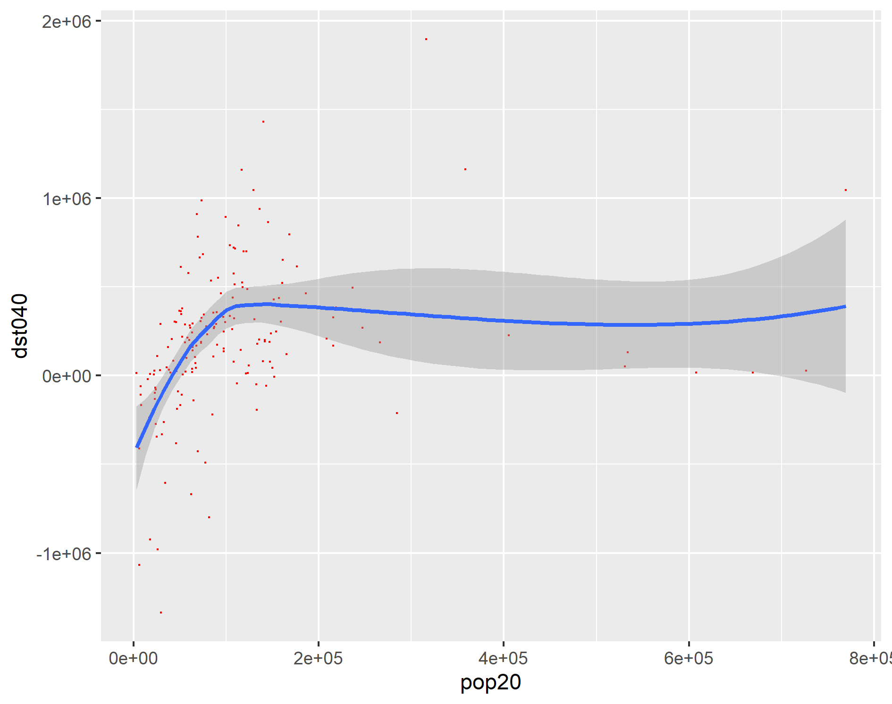
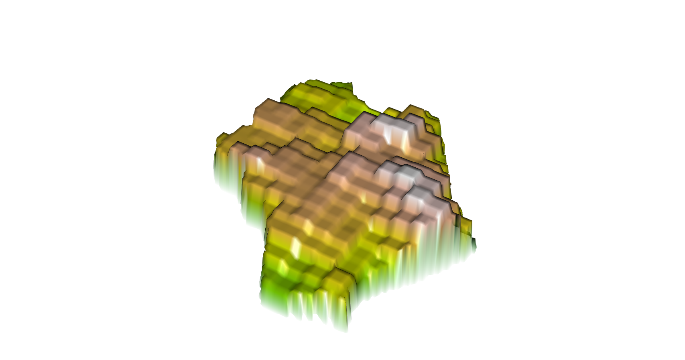
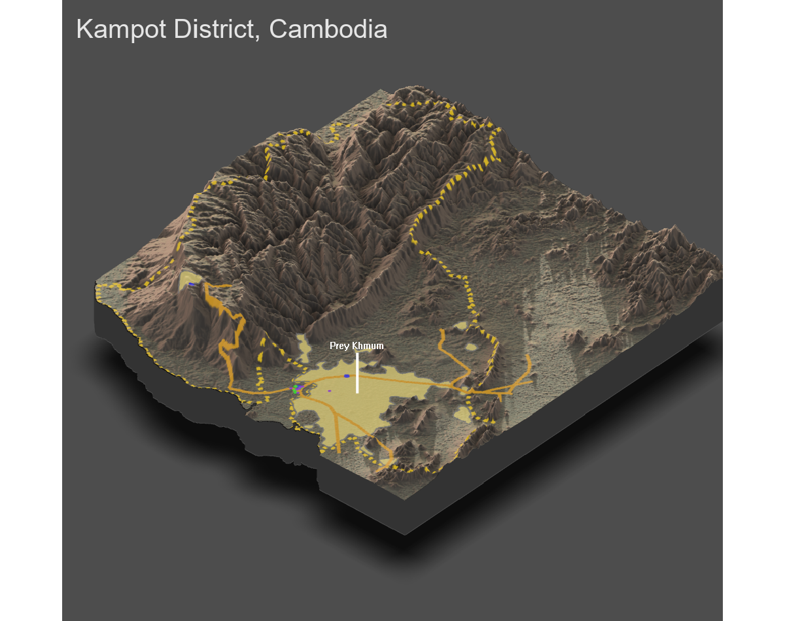

# Final Individual Deliverable: Cambodia

Brian Lorn

## Political Subdivisions of Cambodia

The map above depicts the first administrative subdivisions of Cambodia known as provinces and the second administrative subdvisions which are known as districts. The dark gold outline delineates the international borders of Cambodia while the thinner, orange lines show the separation of the provinces. In addition, the bright gold lines differentiate the districts, so the lines become lighter and thinner as the administrative level decreases. Lastly, the black text represents the names of the provinces while the smaller, red text represents the districts. The map shows that most of the districts reside in the south. One reason for this is their proximity to the capital which necessitates the use of several subdivisions in order to properly represent the dense population. In total, the country of Cambodia spans roughly 180,000 square kilometers.

In terms of areas of focus, I chose to examine Phnom Penh and the Kampot district. In this instance, I refer to the autonomous municipality of Phnom Penh which is legally equivalent to a province, meaning it is classified as a first administrative subdivision. In addition, the municipality also contains the capital of Cambodia which is also named Phnom Penh. However, it should be noted that the Kampot district has been renamed to the Tuek Chhou district. 

## Population of Cambodia

The map above depicts the provinces of Cambodia by their population and density. Additionally, it also has a figure which shows how much each province represents in comparison to the total population within Cambodia which is roughly 16 million people. The gray outlines delineate between provinces and show the international border while the black text represents the names of the provinces. Note that the data used to create this model was collected in 2020 from WorldPop.

Looking at the map, it is clear that Phnom Penh, Siemréab, and Batdâmbâng have the highest populations. For Phnom Penh, this is expected because it is the capital of the country. Within Siemréab, there is a temple named Angkor Wat which is a popular tourist destination, meaning there is a lot of business in and around the area. Due to that, the region has an incredibly large population. Finally, for Batdâmbâng, the area is the leading rice-producing province and is an important trading center which connects Phnom Penh to Thailand. This explains why the population is incredibly dense along with the amount of districts seen clustered around it in the previous model.

## Population of Phnom Penh

After exploring the population distribution of the entire country, I narrowed my focus to the municipality of Phnom Penh. First, I began by testing different models of populations.

The figure above is a linear model between population and data on trees. For the figure, the adjusted R-squared value is 0.06223 while the p-value is 0.0004602. The former represents how well the two variables are represented by a linear model. Since the value is as low as 0.06223, this demonstrates that only using data on trees to predict population will give a very poor result. The latter describes how accurate this data is compared to the alternative, so this value should be as low as possible in order to ensure that the data being represented is correct. Compared to most p-values, this is rather high which calls the accuracy of our model into question.

The figure above is a linear model between population and the sum of all the covariates within the land use and land cover package. For the figure, the adjusted R-squared value is 0.5845 while the p-value is 2.2e-16. Since the R-squared value is much higher than the previous models which used less variables, this demonstrates that using more variables increases the accuracy of our model. In addition, the p-value found in this model is significantly lower than it was previously which gives credibility to this model. Thus, predicting population based on a sum of all of its covaraites is fairly accurate and will be used as the model of population for Phnom Penh.

The figure above is a 3D model of Phnom Penh at the second level administrative subdivision of Cambodia. I chose to model this rather than the entire municipality of Phnom Penh because the surrounding areas had an extremely large difference in population, making it hard to model both areas with nuance. In addition, this was a model using data from the second administrative division along with a population model found through summing all of the land use and land cover covariates. 

The figure above is a map of the difference between the predicted values of population and the actual population. Within this model, the difference between the predicted and actual values of population is only 200 on average, meaning the population model is a fairly accurate depiction of the city. Taking both figures into consideration, it can be seen that the densest areas of population also coincide with the densest areas of urban development.

## Human Settlements, Roadways, and Health Care Facilities within the Kampot District

The figure above is a map of the Kampot district which is a second level administrative division within Cambodia. Throughout the entire region, there is a total population of 143,540 people. The figure depicts the urbanized areas and their population densitites throughout the region. These areas were found by sifting through population counts and densities. The large urabnized area located in the eastern part of the district is connected to another district to the southwest which is much smaller but highly populated in comparison to Kampot.

In addition to the urbanized areas and population density, the figure above also depicts major roadways and health care services throughout the region. For the map, blue dots denote a hospital, green dots signify pharmacies, and purple dots are all the other services. These other services are comprised of doctors, dentists, and clinics. As shown by the figure, most of the major road networks reside in the south in order to travel in between the largest shaded area and the urbanized district found below. This makes sense because most of the north is sparsely populated. Outside the eastern part of the district, there are few to no primary roads, making it difficult to travel accross the region. While it is difficult to traverse the region due to the lack of primary roads, the region does not need them since most of its population is centered near primary roadways.

For the health care services, a majority of the services reside outside the district. This means that most people must make a long commute in order to access health care services with the exception of those who live near the southern border. Additionally, there are no services offered in the northern regions of the district. Thus, access to health care services is rather poor for this district.

The figure above is a 3D model of the Kampot district with the same information from the previous map. Within the model, it can be seen that most of the western parts of the region are mountinous. This moutinous region explains most of the conclusions reached from the previous map. Since mountinous terrain discourages human settlements, there is little population anywhere within that entire region. Due to a lack of population, there is no need to have roadways through that part of the region since there is an extremely low amount of traffic. Lastly, there are no health care facilities in the north because the region has very few settlements due to the terrain. Thus, there is a lack of human development in most of the district due to the mountinous terrain.
