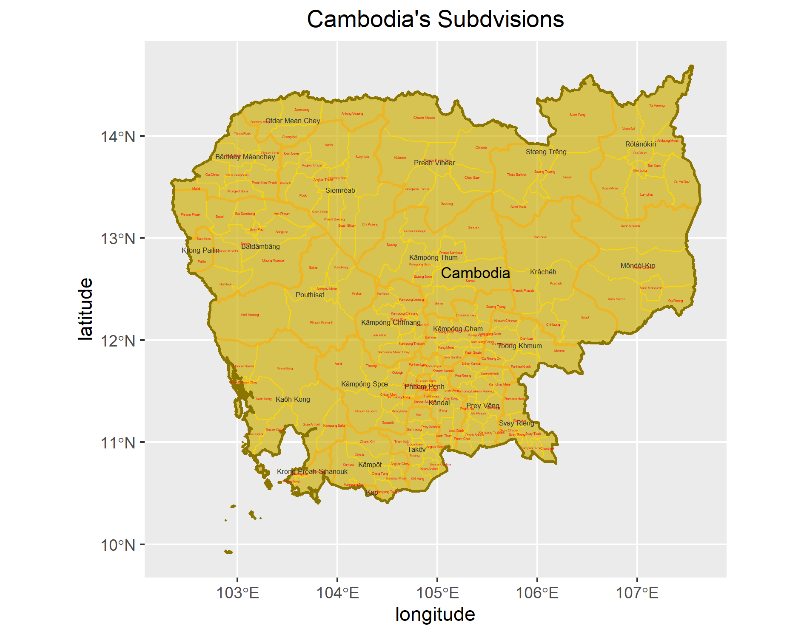

# Final Individual Deliverable: Cambodia

Brian Lorn

## Political Subdivisions

The map above depicts the first administrative subdivisions of Cambodia known as provinces and the second administrative subdvisions which are known as districts. The dark gold outline delineates the international borders of Cambodia while the thinner, orange lines show the separation of the provinces. Lastly, the bright gold lines differentiate the districts, so the lines become lighter and thinner as the administrative level decreases. In addition, the black text represents the names of the provinces while the smaller, red text represents the districts. In total, the country of Cambodia spans roughly 180,000 square kilometers.

In terms of areas of focus, I chose to examine Phnom Penh and the Kampot district. In this instance, I refer to the autonomous municipality of Phnom Penh which is officially equivalent to a province, meaning it is classified as a first administrative subdivision. In addition, the municipality also contains the capital of Cambodia which is also named Phnom Penh. However, it should be noted that the Kampot district has been renamed to the Tuek Chhou district. Interestingly, both of these regions are in the southern part of Cambodia. 
