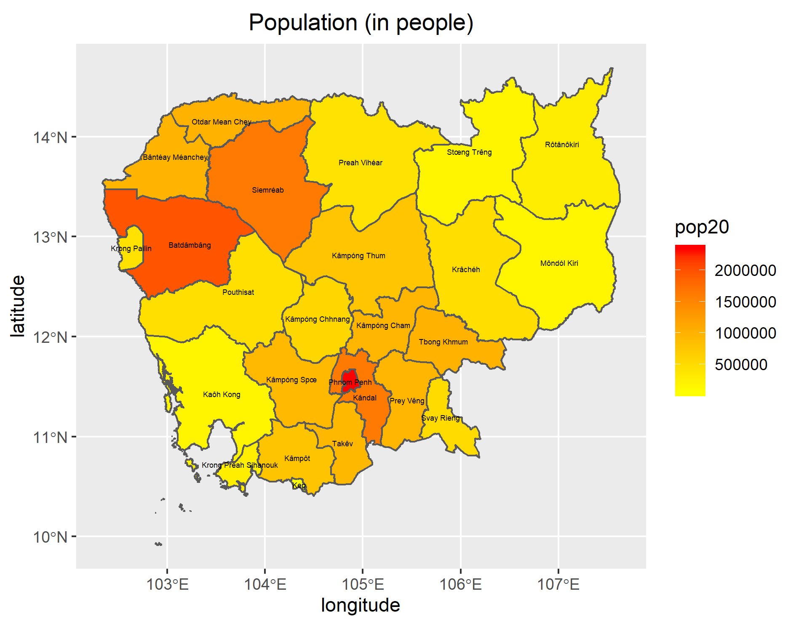

# Project 1: Cambodia

Brian Lorn

## Administrative Subdivisions of Cambodia

The following map depicts the first administrative subdivisions of Cambodia known as provinces and the second subdivisions which are districts. The dark gold outline delineates the international borders of Cambodia while the thinner, orange lines show the separation of the provinces. Lastly, the bright gold lines differentiate the districts, so the lines become lighter and thinner as the administrative level decreases. In addition, the black text represents the names of the provinces while the smaller, red text represents the districts.

One of the challenges I faced when creating this model was the non-uniform appearance of the districts. Looking at the model, most of the districts are centered around the capital Phnom Penh which makes it hard to read if the text size is too large. However, if I chose to make the text size much smaller, there would be a similar problem. In order to remedy this, I chose to change the text color to red in order to make it more legible and distinct from the name of the provinces. After creating this model, I was intrigued as to why there were so many districts clustered around certain areas. After doing a bit of research, I was able to learn that the districts near the south are near the capital, necessitating several districts in order to properly represent the dense population. For the north west, there is a temple named Angkor Wat located in Siemréab. Due it being a popular tourist destination, there is a lot of business in and around the area which needs several districts in order to represent its dense population.

## Population of Cambodia's Provinces

The following map depicts the provinces of Cambodia by their population.

## Population of Cambodia's

