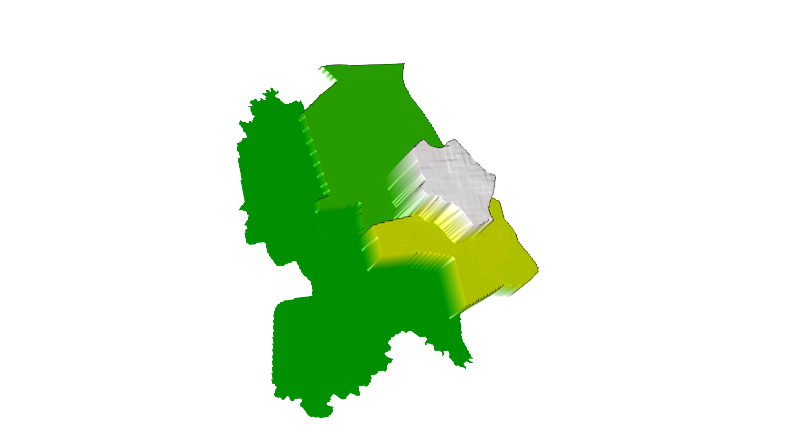

# Project 2: Cambodia

Brian Lorn

## Phnom Penh (using ADM1)

The figure above is a 3D model of Phnom Penh at the first level administrative division of Cambodia. While the first level divisions are usually known as provinces, Phnom Penh is classified as an autonomous municipality. This was a model using data from the first administrative division along with a population model found through summing all of the land use and land cover covariates. Since Cambodia's population is highly concentrated in urban areas and extremely low in rural areas, the city Phnom Penh is highly elevated compared to the other regions. In addition, the population has not undergone a logarithmic operation, so the population of each region can vary greatly which is shown by the large difference in elevation.

The figure above is a map of the difference between the predicted values of population and the actual population. Since the data is only from the first administrative division, the model has much less data than higher administrative levels, so the predicted model will be less accurate. This is shown by the following graph which also shows that higher populated areas are harder to accurately model. For example, the lower populated areas only have a difference between the predicted and actual population of 200 while the higher populated areas are over or underestimated by 600.  

## Phnom Penh (using ADM2)

The figure above is a 3D model of Phnom Penh at the second level administrative subdivision of Cambodia. While Phonm Penh exists as a first level administrative subdivision, it also exists as an actual city in the second level. This was a model using data from the second administrative division along with a population model found through summing all of the land use and land cover covariates. Compared to the previous model which included regions with large differences of population, this model only includes the highly populated city of Phnom Penh. Due to this, the model is much more effective in showing the distribution of the population across the city of Phnom Penh.

The figure above is a map of the difference between the predicted values of population and the actual population. Since the data is from the first administrative division, the model has much more data than the previous model, so the predicted model will be more accurate. This is shown by the fact that the difference between the predicted and actual values of population is only 200 while the previous model had a difference of 600 for the entirety of the city of Phnom Penh.
