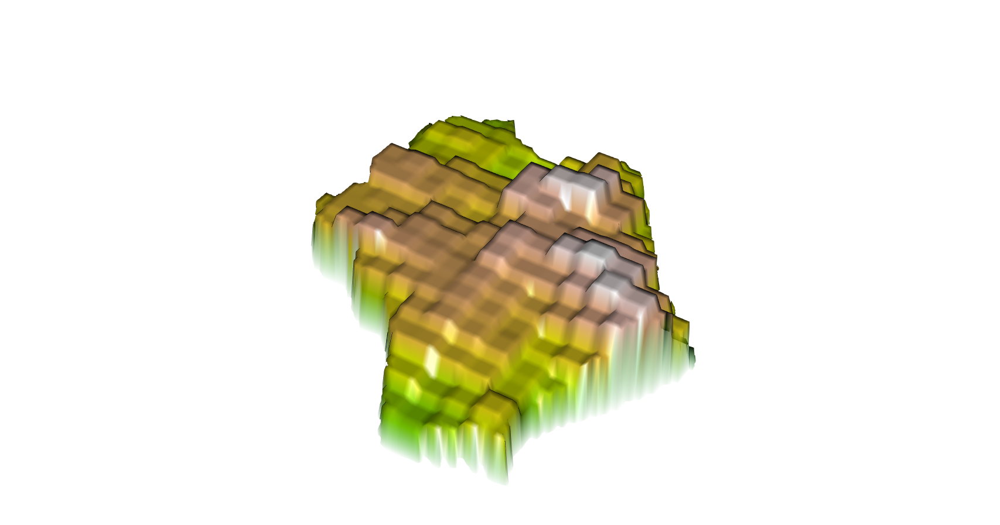

# Project 2: Cambodia

Brian Lorn

## Phnom Penh (using ADM1)

The following is a 3D model of Phnom Penh at the first level administrative subdivision of Cambodia. This was a model using data from the first administrative subdivision along with a population model found through summing all of the land use and land cover covariates. 

The following is a map of the difference between the predicted values of population and the actual population.

## Phnom Penh (using ADM2)

The following is a 3D model of Phnom Penh at the second level administrative subdivision of Cambodia. While Phonm Penh exists as a first level administrative subdivision, it also exists as an actual city in the second level. This was a model using data from the second administrative subdivision along with a population model found through summing all of the land use and land cover covariates. 

The following is a map of the difference between the predicted values of population and the actual population.

