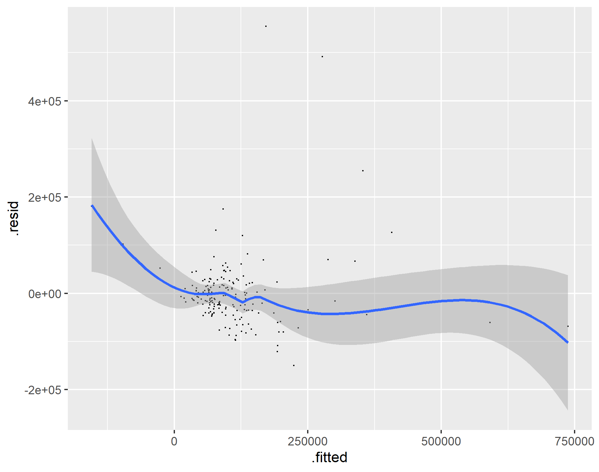

# Project 2: Cambodia

Brian Lorn

## Histograms with Density Plots

The figure above is a histogram combined with a density plot of the dst040 variable which is data on trees across Cambodia's second level administrative divisions. The histogram, represented by the bars of varying heights, describes how often a certain value appears within the data set while the density plot represents the same data except as a continous function. Thus, the figure shows that most of Cambodia's second level administrative divisions have between zero and a million trees.

The figure above is a histogram combined with a density plot of the population of Cambodia across Cambodia's second level administrative divisions after undergoing a logarithmic operation. The histogram, represented by the bars of varying heights, describes how often a certain value appears within the data set while the density plot represents the same data except as a continous function. Thus, the figure shows that most of Cambodia's second level administrative divisions have similar populations with some outliers at the latter end. This fits in line with Cambodia having many lowly populated rural areas coupled with a few densely populated urban areas.

## Linear Models

The figure above is a linear model between population and data on trees. For the figure, the adjusted R-squared value is 0.06223 while the p-value is 0.0004602. The former represents how well the two variables are represented by a linear model. Since the value is as low as 0.06223, this demonstrates that only using data on trees to predict population will give a very poor result. The latter describes how accurate this data is compared to the alternative, so this value should be as low as possible in order to ensure that the data being represented is correct. Compared to most p-values, this is rather high which calls the accuracy of our model into question.

The figure above is a linear model between population and the sum of all the covariates within the land use and land cover package. For the figure, the adjusted R-squared value is 0.5845 while the p-value is 2.2e-16. Since the R-squared value is much higher than the previous model, this demonstrates that using more variables increases the accuracy of our model. In addition, the p-value found in this model is significantly lower than it was previously which gives credibility to this model. Thus, predicting population based on a sum of all of its covaraites is fairly accurate, and something that will be further explored below to model different regions.

## Phnom Penh (using ADM1)

The figure above is a 3D model of Phnom Penh at the first level administrative division of Cambodia. While the first level divisions are usually known as provinces, Phnom Penh is classified as an autonomous municipality. This was a model using data from the first administrative division along with a population model found through summing all of the land use and land cover covariates. Since Cambodia's population is highly concentrated in urban areas and extremely low in rural areas, the city Phnom Penh is highly elevated compared to the other regions. In addition, the population has not undergone a logarithmic operation, so the population of each region can vary greatly which is shown by the large difference in elevation.

The figure above is a map of the difference between the predicted values of population and the actual population. Since the data is only from the first administrative division, the model has much less data than higher administrative levels, so the predicted model will be less accurate. This is shown by the following graph which also shows that higher populated areas are harder to accurately model. For example, the lower populated areas only have a difference between the predicted and actual population of 200 while the higher populated areas are over or underestimated by 600.  

## Phnom Penh (using ADM2)

The figure above is a 3D model of Phnom Penh at the second level administrative subdivision of Cambodia. While Phonm Penh exists as a first level administrative subdivision, it also exists as an actual city in the second level. This was a model using data from the second administrative division along with a population model found through summing all of the land use and land cover covariates. Compared to the previous model which included regions with large differences of population, this model only includes the highly populated city of Phnom Penh. Due to this, the model is much more effective in showing the distribution of the population across the city of Phnom Penh.

The figure above is a map of the difference between the predicted values of population and the actual population. Since the data is from the first administrative division, the model has much more data than the previous model, so the predicted model will be more accurate. This is shown by the fact that the difference between the predicted and actual values of population is only 200 while the previous model had a difference of 600 for the entirety of the city of Phnom Penh.
