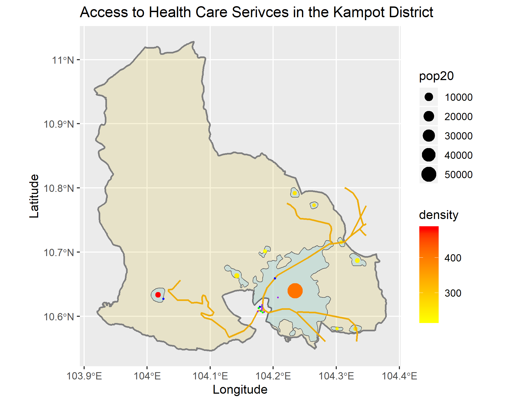

# Project 3: Kampot District

Brian Lorn

The figure above is a map of the Kampot district which is a second level administrative division within Cambodia. The figure depicts the urbanized areas throughout the region which were found by sifting through population counts and densities. While it is referenced as the Kampot district, it should be noted that the name of the region has recently been changed to the Tuek Chhou district. During the creation of the figure, there were many difficulties found in confirming population totals and other statistics due to naming conventions. In particular, there is a province, district, and city all with the same name of Kampot, but since the district has been renamed, searching for information about the district led to data regarding the city.

Throughout the entire region, there is a total population of 143,540 people.
