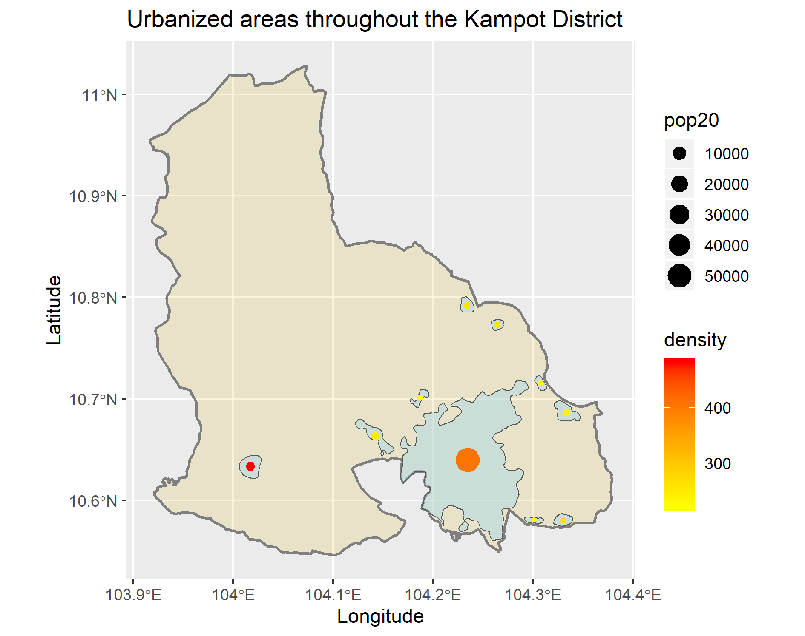

# Project 3: Kampot District

Brian Lorn

The figure above is a map of the Kampot district which is a second level administrative division within Cambodia. The figure depicts the urbanized areas throughout the region which were found by sifting through population counts and densities. Throughout the entire region, there is a total population of 143,540 people. In the figure, there are 10 urbanized areas which are mostly small in size and population density with a few exceptions. The first being the large shaded area to the south. This is an incredibly large and densely packed region which makes sense since the area to the southwest of it is another district that is much smaller but highly populated in comparison to Kampot. Thus, it follows that the region next to this urbanized area would also share similar qualities. The other notable exception is the westmost urban area which actually has the highest population density within the entire map.

While it is referenced as the Kampot district, it should be noted that the name of the region has recently been changed to the Tuek Chhou district. During the creation of the figure, there were many difficulties found in confirming population totals and other statistics due to naming conventions. In particular, there is a province, district, and city all with the same name of Kampot, but since the district has been renamed, searching for information about the district led to data regarding the city. This resulted in incongruent facts between the two that was eventually rectified by comparing the correct regions. 

In addition to the urbanized areas and population density, the figure above also depicts major roadways and health care services throughout the region. For the map, blue dots denote a hospital, green dots signify pharmacies, and purple dots are all the other services. These other services are comprised of doctors, dentists, and clinics. As shown by the figure, most of the major road networks reside in the south in order to travel in between the largest shaded area and the urbanized district found below. This also makes sense because most of the north is rural areas with little populatiton density. While the roads were subsetted to those included in urban areas, it is highly probable that the north mainly travels by local roads, having few to no primary roads for most of its regions. Looking at the location of the health care services, shows a clear correlation with the urbanized area. This means that people who lived in the urbanized regions are able to access health care services. For those that do not live in those areas, health care providers reside a notably large distance from their location shown by there being no services offered in the northern regions. 
