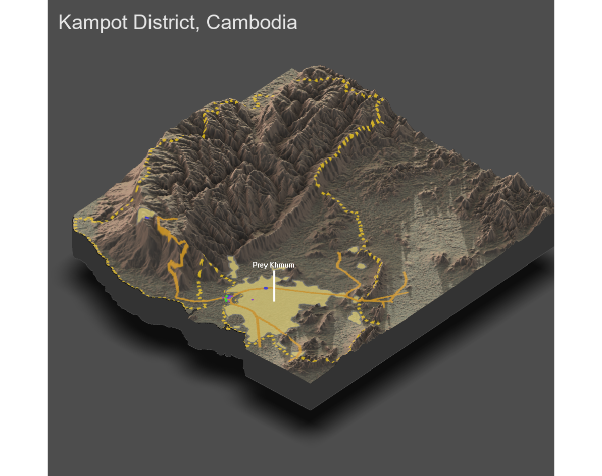

# Project 4: Kampot District

Brian Lorn

## Part 1: Topography

The figure above is a 3D model of the Kampot district which is a second level administrative division within Cambodia. The dashed yellow line delineates the border of the Kampot district while the solid orange line represents the primary roadways for the shaded areas. These gold shaded areas are actually the urban areas of the region found through filtering population data by both minimum population and population density. Lastly, the dots denote health care services. Within the model, the blue dots denote a hospital, green dots signify pharmacies, and purple dots are all the other services. These other services are comprised of doctors, dentists, and clinics.

Within the model, it can be seen that most of the western parts of the region are mountinous. Due to that, there is only one urban area found in the entire mountinous region since highly non-uniform terrain discourages large settlements. This is significant because 2/3 of the entire region is mountinous, meaning all of the other urban areas are located in the eastern region of the district.

How has topography appeared to have impacted the development of urban areas?
How has topography appeared to have impacted the development of transportation facilities?
How has topography appeared to have impacted the location of health care facilities?
Has producing your three-dimensional map resulted in an interpretion that is different from your previous analysis?
